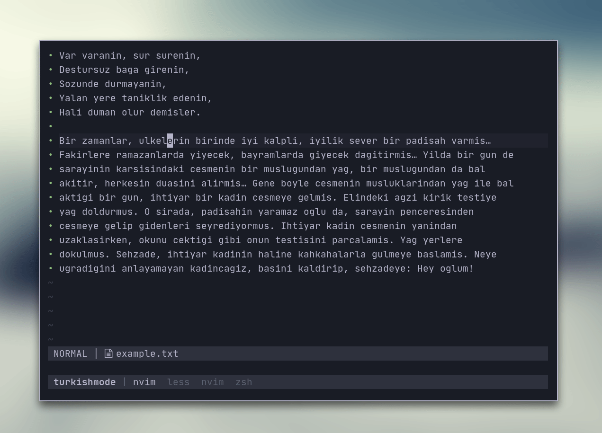

# turkishmode.nvim



This project is a lua port of [this python
project](https://github.com/emres/turkish-deasciifier).

This is for the people trying to type Turkish documents on a U.S. keyboard using
Neovim. The plugin provides a `turkishmode` module that can be asciify and
deasciify the buffer contents and arbitrary strings.

The program uses decision lists (included at the end of this file) which was
created based on 1 million words of Turkish news text using the GPA algorithm.
For more information on GPA see the Greedy prepend algorithm for decision list
induction.

## Features

- Deasciify and asciify the current buffer
- Deasciify and asciify the current line

## Installation

Use your favorite plugin manager in Neovim.

## Usage

You can call the module functions directly:

```viml
:lua require('turkishmode').deasciify_buffer()
:lua require('turkishmode').deasciify_current_line()
:lua require('turkishmode').asciify_buffer()
:lua require('turkishmode').asciify_current_line()
```

You can create commands to call the functions easily:

```viml
:command DeasciifyBuf lua require('turkishmode').deasciify_buffer()
```

You can use the `core` module for raw string asciification and deasciification:

```lua
require('turkishmode.core').deasciify('arbitrary string')
require('turkishmode.core').asciify('arbitrary string')
```

## TODO

- [x] Asciify & Deasciify raw strings
- [x] Asciify & Deasciify buffers and lines
- [ ] Asciification & Deasciification on typing
